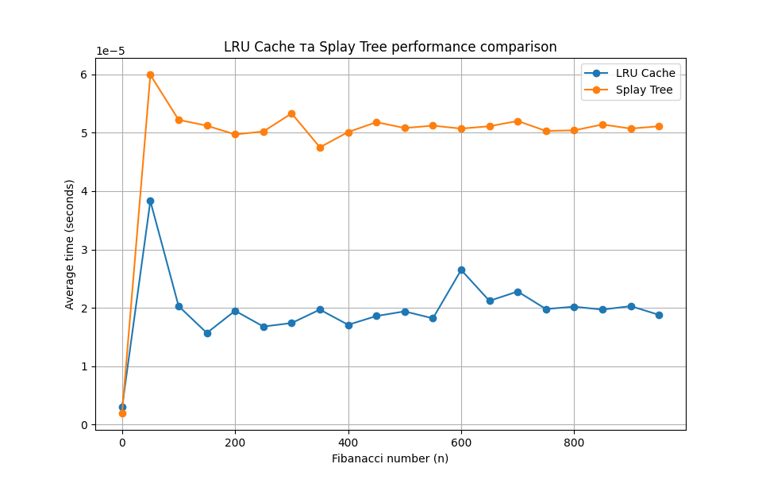

# Cache management algorithms
## Task 1. Data Access Optimization Using LRU Cache

Implement a program to optimize processing of queries to an array of numbers using LRU cache.

### Specifications

1. Given an array of size `N`, consisting of positive integers `(1 ≤ N ≤ 100_000)`. It is necessary to process `Q` queries `(1 ≤ Q ≤ 50_000)` of the following type:

`Range(L, R)` — find the sum of elements in the range from index L to R inclusive.

`Update(index, value)` — replace the value of the element in the array at index index with a new value value.
2. Implement four functions for working with the array:

`range_sum_no_cache(array, L, R)`
The function should calculate the sum of the array elements in the range from `L` to `R` inclusive without using the cache. The result should be calculated anew for each query.

`update_no_cache(array, index, value)`
The function should update the value of the array element at the specified index without using the cache.

`range_sum_with_cache(array, L, R)`
The function should calculate the sum of the elements in the range from `L` to `R` inclusive, using the LRU cache. If the sum for this range has already been calculated before, it should be returned from the cache, otherwise the result is calculated and added to the cache.

`update_with_cache(array, index, value)`
The function should update the value of the array element at the specified index and remove all corresponding values ​​from the cache that have become irrelevant due to a change in the array.

3. To test the program, create an array of `100_000` elements filled with random numbers and generate `50_000` `Range` and `Update` queries in random order.

Example of a query list: `[('Range', 46943, 91428), ('Range', 5528, 29889), ('Update', 77043, 78), ...]`

4. Use an LRU cache of size `K = 1000` to store pre-computed results of Range queries. The cache should automatically remove the least recently used elements if its maximum size is reached.

5. Compare the execution times of the queries:
Without using the cache.
With using the LRU cache.
Print the results in terms of execution times for both approaches.

### Prerequisites 
```bash
poetry install
poetry shell
```

### To run
```bash
poetry run .\app\task1.py
```

### Result 
```bash
length of array: 100000
number of scenarios: 50000
length of scenarios: 50000 generated
number of range scenarios: 25011, number of update scenarios: 24989
Execution time without caching: 95.13 seconds
Execution time with LRU cache: 97.86 seconds
```

### Conclusion
The performance degradation is caused by frequent cache updates and a wide range of keys.

## Task 2. Comparison of the performance of calculating Fibonacci numbers using LRU cache and Splay Tree

Implement a program for calculating Fibonacci numbers in two ways: using LRU cache and using Splay Tree to store previously calculated values. Conduct a comparative analysis of their efficiency by measuring the average execution time for each approach.

### Specifications

1. Implement two functions for calculating Fibonacci numbers:

`fibonacci_lru(n)`
The function should use the `@lru_cache` decorator to cache the results of the calculations. Thanks to this, it can reuse previously calculated values ​​of Fibonacci numbers.

`fibonacci_splay(n, tree)`
The function uses the Splay Tree data structure to store the calculated values. If the Fibonacci number for a given n has already been calculated, the value should be returned from the tree, otherwise the value is calculated, stored in the Splay Tree and returned.

2. Measure the execution time of the Fibonacci number calculation for each approach:

Create a set of Fibonacci numbers from 0 to 950 in steps of 50: 0, 50, 100, 150, ....
Use the timeit module to measure the execution time of the calculations.
For each value of n, calculate the average execution time of the Fibonacci number calculation using the LRU cache and the Splay Tree.
3. Construct a graph that compares the execution time for the two approaches:

Use the matplotlib library to construct the graph.
On the x-axis, display the value of n — the Fibonacci number.
On the y-axis — the average execution time in seconds.
Add a legend to the graph that indicates the two approaches: LRU Cache and Splay Tree.
4. Draw conclusions about the efficiency of both approaches based on the resulting graph.

5. In addition to plotting the graph, output a text table containing the value of n, the average execution time for the LRU Cache, and the Splay Tree. The table should be formatted for easy reading.

### Prerequisites 
```bash
poetry install
poetry shell
```

### To run
```bash
poetry run .\app\task2.py
```

### Result
```bash
  LRU Cache та Splay Tree performance comparison  
┏━━━━━┳━━━━━━━━━━━━━━━━━━━━┳━━━━━━━━━━━━━━━━━━━━━┓
┃  n  ┃ LRU Cache Time (s) ┃ Splay Tree Time (s) ┃
┡━━━━━╇━━━━━━━━━━━━━━━━━━━━╇━━━━━━━━━━━━━━━━━━━━━┩
│  0  │     0.00000300     │     0.00000200      │
│ 50  │     0.00003830     │     0.00005990      │
│ 100 │     0.00002030     │     0.00005220      │
│ 150 │     0.00001570     │     0.00005120      │
│ 200 │     0.00001950     │     0.00004970      │
│ 250 │     0.00001680     │     0.00005020      │
│ 300 │     0.00001740     │     0.00005330      │
│ 350 │     0.00001970     │     0.00004750      │
│ 400 │     0.00001710     │     0.00005010      │
│ 450 │     0.00001860     │     0.00005180      │
│ 500 │     0.00001940     │     0.00005080      │
│ 500 │     0.00001940     │     0.00005080      │
│ 550 │     0.00001820     │     0.00005120      │
│ 600 │     0.00002650     │     0.00005070      │
│ 650 │     0.00002120     │     0.00005110      │
│ 700 │     0.00002280     │     0.00005200      │
│ 750 │     0.00001980     │     0.00005030      │
│ 800 │     0.00002020     │     0.00005040      │
│ 850 │     0.00001970     │     0.00005140      │
│ 900 │     0.00002030     │     0.00005070      │
│ 950 │     0.00001880     │     0.00005110      │
└─────┴────────────────────┴─────────────────────┘
```



### Conclusion
The study results indicate that the Splay Tree cache performs worse than the LRU cache within the examined value range.

### Run test
```bash
python -m unittest .\tests\tests.py
```